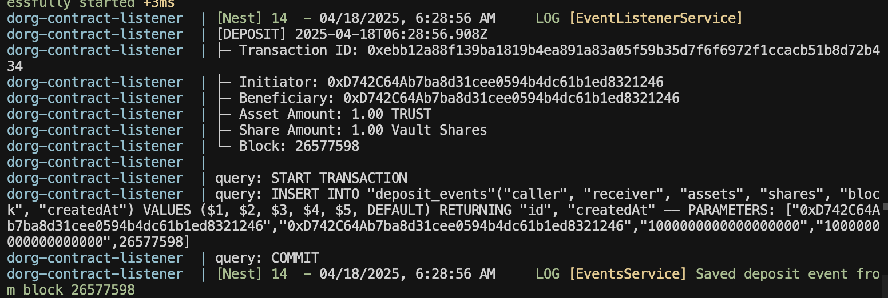

# Dorg Vault Event Listener

Monitoring and indexing ERC4626 vault activities. The system consists of three main components working together to provide complete visibility into vault operations.

## Apps
- `contract-listener`: NestJS event monitoring service
- `contracts`: Hardhat project with vault implementation
- `graph`: Subgraph indexing service

## 1. NestJS Event Listener Service
The core component that uses ethers.js to monitor the vault contract in realtime. It captures all deposit and withdrawal events, stores them in a PostgreSQL database, and provides RESTful API endpoints for querying the data.

### Features
- Built with NestJS framework
- Uses ethers.js for blockchain interaction
- Realtime event monitoring
- PostgreSQL database storage
- RESTful API endpoints
- Transaction history tracking




### Setup
First, navigate to the app:
```bash
cd apps/contract-listener
```

Then, rename the .env.example to .env and configure the environment variables:
```bash
# Application
PORT=3000
NODE_ENV=development

# Database
DATABASE_HOST=dorg-postgres
DATABASE_PORT=5432
DATABASE_USER=postgres
DATABASE_PASSWORD=postgres
DATABASE_NAME=dorg

# Blockchain
WS_URL=wss://opt-sepolia.g.alchemy.com/v2/YU9cnPZhP1bB5L73LlbCJX7JOk61DYYf
CONTRACT_ADDRESS=0x6aA4C7396579cE2666F38acB9dfB84BD373e4CB9
START_BLOCK=26544587
```

Start the service:
```bash
docker compose up
```

### API Endpoints
[Postman Collection](https://planetary-astronaut-260422.postman.co/workspace/My-Workspace~59e48519-9333-4809-8997-778169833954/collection/20760754-bd4644f7-1d09-4c91-8813-3b7f682fe447?action=share&creator=20760754)

Available endpoints:
- `GET /vault/deposits/:wallet` - Deposit summary
- `GET /vault/withdrawals/:wallet` - Withdrawal summary
- `GET /vault/deposits/:wallet/history` - Deposit history
- `GET /vault/withdrawals/:wallet/history` - Withdrawal history

## 2. Hardhat
A set of command-line tools for interacting with the vault.

### Network Configuration
- Network: Optimism Sepolia
- Vault Address: [0x6aA4C7396579cE2666F38acB9dfB84BD373e4CB9](https://optimism-sepolia.blockscout.com/address/0x6aA4C7396579cE2666F38acB9dfB84BD373e4CB9)
- Underlying Token: [Trust (0x6B73Afbd5b53827F6d741dD27157E0c34Da83Ff9)](https://optimism-sepolia.blockscout.com/address/0x6B73Afbd5b53827F6d741dD27157E0c34Da83Ff9?tab=index) (Deployed using [Thirdweb](https://thirdweb.com/))

### Deployment
To deploy the vault to Optimism Sepolia:

1. Navigate to the contracts directory:
```bash
cd apps/contracts
```

2. Configure your environment:
```bash
# Copy the example environment file
cp .env.example .env

# Add your private key
PRIVATE_KEY=your_private_key
```

3. Configure the vault module:
- Open `apps/contracts/ignition/modules/vault.ts`
- Update the `mockERC20Address` parameter with your desired ERC20 token address
```typescript
const mockERC20Address = m.getParameter("Trust", "YOUR_ERC20_ADDRESS");
```

4. Deploy the vault:
```bash
# Deploy using Hardhat Ignition
pnpm hardhat ignition deploy ignition/modules/vault.ts --network op-sepolia
```

### Contract Interaction
The following tasks are available for generating test events. Before running any task, ensure to update the contract addresses in the respective task files found at 'apps/contracts/tasks':

```bash
# Approve tokens
pnpm hardhat approve --amount <amount> --network <network>

# Deposit tokens
pnpm hardhat deposit --amount <amount> --network <network>

# Withdraw tokens
pnpm hardhat withdraw --amount <amount> --network <network>
```

## 3. Subgraph
A GraphQL-based indexing service that provides efficient querying of historical vault data, enabling complex analytics and historical tracking.

### Features
- Event indexing
- Historical data analysis
- GraphQL query support
- Playground: [The Graph Studio](https://api.studio.thegraph.com/query/109471/dorg-vault/version/latest)
